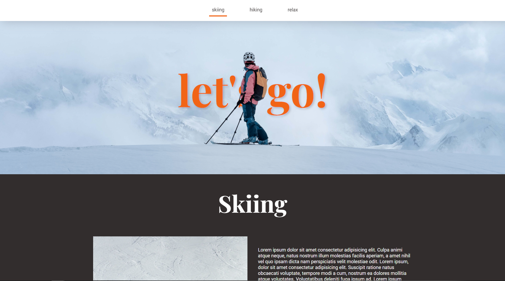

# SPA with custom parallax effect

The project was made for a college course credit. The most important concepts were:

- create a responsive site consisting of several sections,
- each section should have its own background having a parallax effect when scrolling,
- the page should include a horizontal menu that sticks to the top edge of the browser,
- click on a menu item, the page scrolls to the contents of the selected menu option,
- lazy loading - dynamically loading an image or text only for the current section.

### Initial view


### Scrolling



## Setup

To run this project, install it locally using npm:

```
$ cd ../parallax-app
$ npm install
$ npm run dev
```
